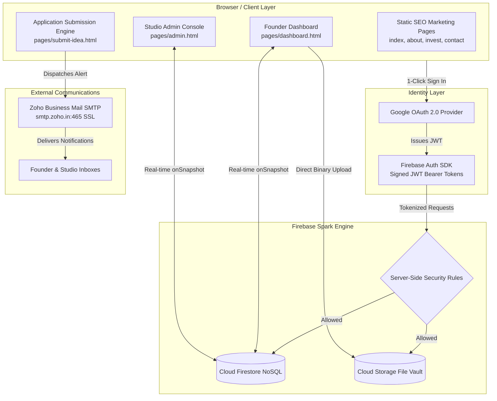
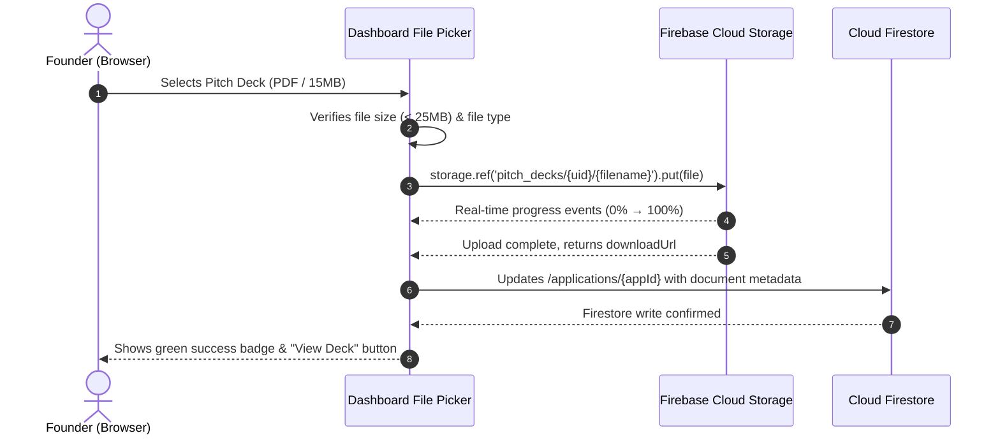

# Technical Architecture Document
## Ideacubator Venture Studio Platform

**Architecture Version:** 1.0  
**Stack Paradigm:** Event-Driven Serverless Single-Page Platform + Google Firebase Engine  
**Hosting Environment:** Firebase Hosting (Spark Plan) / Vercel Edge  
**Domain:** `https://ideacubator.in`  

---

## 1. System Topology & Component Interactions



---

## 2. Cloud Firestore Schema Specifications

### Collection 1: `/users/{userId}`
Stores public and operational profiles for authenticated Google users.
```typescript
interface UserProfile {
  uid: string;                 // Google Auth UID
  email: string;               // Verified Gmail / Workspace email
  displayName: string;         // Full name from Google Profile
  photoURL: string;            // Google Avatar URL
  role: 'founder' | 'admin';   // Assigned role based on domain check
  phone?: string;              // Optional contact phone number
  createdAt: FirebaseFirestore.Timestamp;
  lastLoginAt: FirebaseFirestore.Timestamp;
}
```

### Collection 2: `/applications/{applicationId}`
The primary venture record representing a founder's submission through the 5 studio phases.
```typescript
interface ApplicationRecord {
  id: string;                  // Unique Firestore Document ID
  userId: string;              // Google Auth UID of submitting founder
  founderEmail: string;        // Founder's contact email
  founderName: string;         // Founder's full name
  founderPhone: string;        // Contact phone
  founderType: 'student' | 'working_professional' | 'business_raising' | 'other';
  
  // Venture Attributes
  ventureName: string;         // Startup / Concept Name
  industry: string;            // Fintech, Healthtech, AI, B2B SaaS, CleanTech, etc.
  tagline: string;             // One-sentence summary
  problemStatement: string;    // Core problem being addressed
  targetAudience: string;      // Customer persona / market segment
  currentStage: string;        // Idea / Prototype / Early Traction
  tractionSummary: string;     // Revenue, waitlist, users (if applicable)
  competitorDifferentiator: string; // What makes this unique
  studioAssistanceNeeded: string[]; // ['mvp_build', 'architecture', 'gtm', 'funding']

  // Documents & Decks
  documents: Array<{
    fileName: string;
    fileSize: number;
    downloadUrl: string;
    storagePath: string;
    uploadedAt: FirebaseFirestore.Timestamp;
  }>;
  externalPitchUrl?: string;   // Optional Google Drive / DocSend / Pitch link

  // Studio Progression
  stage: 1 | 2 | 3 | 4 | 5;    // Phase 01 to Phase 05
  status: 'submitted' | 'under_review' | 'interview_scheduled' | 'accepted' | 'graduated' | 'archived';
  evaluationScore?: {
    marketOpportunity: number; // 1-10
    technicalFeasibility: number;
    founderConviction: number;
    notes: string;
  };
  submittedAt: FirebaseFirestore.Timestamp;
  updatedAt: FirebaseFirestore.Timestamp;
}
```

### Collection 3: `/applications/{applicationId}/messages/{messageId}`
Real-time bi-directional chat threads linked directly to each specific venture.
```typescript
interface ChatMessage {
  id: string;
  applicationId: string;
  senderId: string;            // Google UID
  senderEmail: string;
  senderName: string;
  senderAvatar: string;
  senderRole: 'founder' | 'studio';
  content: string;             // Message body text
  attachmentUrl?: string;      // Optional file attachment
  timestamp: FirebaseFirestore.Timestamp;
  isRead: boolean;
}
```

### Collection 4: `/meetings/{meetingId}`
Booked video evaluations and diligence calls between founders and studio partners.
```typescript
interface MeetingRecord {
  id: string;
  applicationId: string;
  founderId: string;
  founderEmail: string;
  founderName: string;
  scheduledDate: string;       // YYYY-MM-DD
  scheduledTime: string;       // HH:MM (24h)
  timezone: string;            // e.g. "Asia/Kolkata"
  durationMinutes: number;     // Standard: 30
  meetingTitle: string;        // e.g. "Ideacubator Phase 01 Diligence Call"
  videoCallUrl: string;        // Google Meet link (e.g. https://meet.google.com/xyz-abcd-efg)
  status: 'confirmed' | 'rescheduled' | 'cancelled' | 'completed';
  createdAt: FirebaseFirestore.Timestamp;
}
```

---

## 3. Server-Side Security Rules (Zero-Breach Guarantee)

### Firestore Security Rules (`firestore.rules`)
```javascript
rules_version = '2';
service cloud.firestore {
  match /databases/{database}/documents {

    // Helper Functions
    function isAuthenticated() {
      return request.auth != null;
    }

    function isAdmin() {
      return isAuthenticated() && (
        request.auth.token.email == 'team@ideacubator.in' ||
        request.auth.token.email == 'brijesh@ideacubator.in'
      );
    }

    function isOwner(userId) {
      return isAuthenticated() && request.auth.uid == userId;
    }

    // User Profiles
    match /users/{userId} {
      allow read: if isAuthenticated();
      allow write: if isOwner(userId) || isAdmin();
    }

    // Applications Collection
    match /applications/{appId} {
      allow create: if isAuthenticated();
      allow read, update: if isAuthenticated() && (
        resource.data.userId == request.auth.uid || isAdmin()
      );
      allow delete: if isAdmin();

      // Nested Chat Messages
      match /messages/{messageId} {
        allow read, create: if isAuthenticated() && (
          get(/databases/$(database)/documents/applications/$(appId)).data.userId == request.auth.uid ||
          isAdmin()
        );
        allow update, delete: if isAdmin();
      }
    }

    // Meetings Collection
    match /meetings/{meetingId} {
      allow create: if isAuthenticated();
      allow read, update: if isAuthenticated() && (
        resource.data.founderId == request.auth.uid || isAdmin()
      );
      allow delete: if isAdmin();
    }
  }
}
```

### Firebase Cloud Storage Rules (`storage.rules`)
```javascript
rules_version = '2';
service firebase.storage {
  match /b/{bucket}/o {

    function isAuthenticated() {
      return request.auth != null;
    }

    function isAdmin() {
      return isAuthenticated() && (
        request.auth.token.email == 'team@ideacubator.in' ||
        request.auth.token.email == 'brijesh@ideacubator.in'
      );
    }

    // Pitch Decks & Confidential Founder Documents
    match /pitch_decks/{userId}/{fileName} {
      allow read: if isAuthenticated() && (request.auth.uid == userId || isAdmin());
      allow write: if isAuthenticated() && request.auth.uid == userId &&
        request.resource.size < 25 * 1024 * 1024; // 25 MB max limit
    }
  }
}
```

---

## 4. Document Upload Flow (Firebase Cloud Storage)



---

## 5. Zoho Mail Transactional Notification Architecture

### SMTP Configuration
* **Server:** `smtp.zoho.in` (Port 465 SSL)
* **Authentication:** `team@ideacubator.in` + Application-Specific Password
* **Sender Alias:** `Ideacubator Venture Studio <team@ideacubator.in>`

### Standard Calendar (`.ics`) Invite Generator
When a meeting is scheduled in `/meetings/{id}`, the system dynamically generates an RFC 5545 compliant `.ics` payload:
```
BEGIN:VCALENDAR
VERSION:2.0
PRODID:-//Ideacubator//Venture Portal//EN
CALSCALE:GREGORIAN
METHOD:REQUEST
BEGIN:VEVENT
UID:meeting-{id}@ideacubator.in
DTSTAMP:20260929T140000Z
DTSTART:20261005T100000Z
DTEND:20261005T103000Z
SUMMARY:Ideacubator Phase 01 Diligence Discovery Call
DESCRIPTION:Diligence and technical feasibility review with the Ideacubator venture team.\n\nVideo Call Link: https://meet.google.com/xyz-abcd-efg
LOCATION:Google Meet (https://meet.google.com/xyz-abcd-efg)
STATUS:CONFIRMED
ORGANIZER;CN=Ideacubator Studio:mailto:team@ideacubator.in
ATTENDEE;ROLE=REQ-PARTICIPANT;PARTSTAT=ACCEPTED;CN=Founder:mailto:{founderEmail}
END:VEVENT
END:VCALENDAR
```
This payload is attached to the email dispatched through Zoho SMTP, automatically injecting the meeting into the founder's and studio's Google or Apple Calendar.
