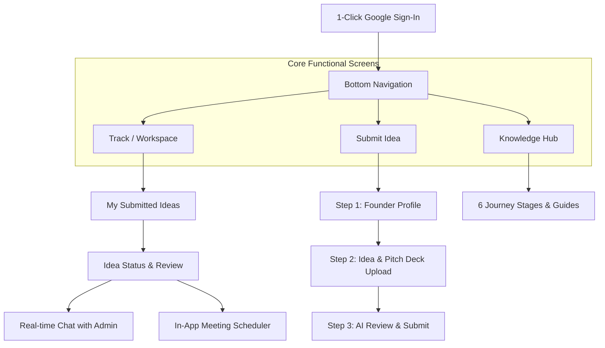

# Ideacubator Mobile App Plan (React Native iOS & Android)

## 1. Core Focus: Simple, Fast, Purpose-Built

The mobile app focuses strictly on the core founder loop with zero fluff:
1. **1-Click Google Sign-In** (seamless authentication using the existing Firebase backend).
2. **Submit Idea**: Streamlined 3-step form with standard file picker (PDF, PPT, doc, images).
3. **Track Idea (Founder Workspace)**:
   - Live status badge (`Submitted` → `Under Review` → `Diligence Call` → `Accepted`).
   - Real-time in-app chat with the Ideacubator team.
   - Schedule meeting with studio admin.
4. **Push Notifications**: Instant alerts when admin replies in chat or updates status.
5. **Knowledge Hub**: Simple mobile reading view for the 6 journey stages & video masterclasses.

---

## 2. App Structure & Screens

---

## 3. Screen Breakdown

### Screen 1: Track Ideas (Founder Dashboard — Default View)
- If founder has an existing submission:
  - **Live Status Tracker**: Visual milestone timeline (`Submitted`, `Under Review`, `Diligence`, `Accepted`).
  - **Chat with Studio**: Direct real-time chat with the Ideacubator diligence team (backed by Firestore).
  - **Schedule Meeting**: Pick an available slot directly in-app; alerts the Ideacubator mailbox.
  - **AI Scorecard Summary**: View the evaluation generated upon submission.
- If founder has no submissions yet:
  - Clean card: *"You haven't submitted an idea yet. Ready to build?"* → Button: `Submit an Idea →`.

### Screen 2: Submit Idea (3-Step Stepper)
- **Step 1: Founder Profile**:
  - Auto-populated name & email from Google Auth.
  - "What best describes you?" dropdown (Student, Professional, Domain Expert, etc.).
  - WhatsApp / phone number.
- **Step 2: Idea Details**:
  - Title, 1-liner summary, and problem description.
  - Standard file picker: Upload pitch deck / summary (PDF, PPT, or images).
- **Step 3: AI Review & Final Submit**:
  - Instant clarity feedback scorecard.
  - Submit button → Saves to Firestore → Notifies admin → Switches founder to the Track tab.

### Screen 3: Knowledge Hub (Simple Reference)
- Clean, scrollable list of the 6 stages:
  1. `Idea` (Discover & Validate)
  2. `Pitch` (5-Box Story)
  3. `Plan` (Milestones & Funding)
  4. `Prototype` (Lean MVP)
  5. `Launch` (Go-to-Market)
  6. `Grow` (Scale & Unit Economics)
- Tap any stage to expand concise bullet points and watch the embedded video lesson.

---

## 4. Technology Stack (Lean & Standard)

- **Framework**: **React Native with Expo SDK 52** (Managed workflow).
- **Auth**: `@react-native-google-signin/google-signin` + Firebase Auth (1-tap Google login).
- **Database / Backend**: Cloud Firestore (same database and collections used by the web portal).
- **File Upload**: `expo-document-picker` uploading to Firebase Storage.
- **Push Notifications**: `expo-notifications` (sends push notifications when admin replies in chat or updates status).
- **Styling**: Standard React Native StyleSheet or NativeWind matching Ideacubator branding (`#8f3f17` terracotta, cream, dark mode).

---

## 5. Implementation Roadmap (When Ready to Build)

1. **Step 1: Scaffold & Auth**
   - Initialize Expo project (`ideacubator-mobile`).
   - Configure Firebase SDK and 1-Click Google Sign-In.
2. **Step 2: Submit Idea Flow**
   - Build the 3-step form using standard inputs.
   - Wire standard document picker to Firebase Storage.
   - Connect to existing AI review endpoint.
3. **Step 3: Track Idea & Real-time Chat**
   - Display submitted ideas list and status progression.
   - Real-time Firestore chat sync between founder and admin.
   - In-app scheduler sending notification to Ideacubator team.
4. **Step 4: Push Notifications & Static Hub**
   - Register device push token to user profile.
   - Add static Knowledge Hub view.
5. **Step 5: App Store & Play Store Build**
   - Run `eas build -p android` and `eas build -p ios`.
